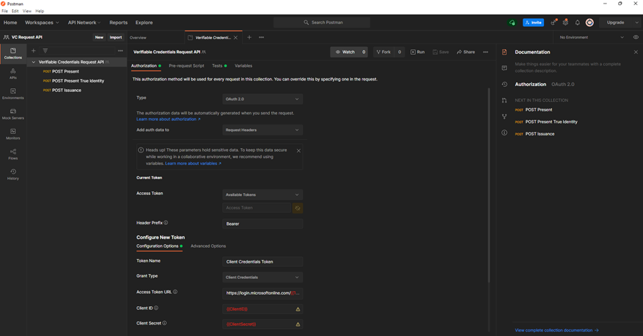

# Use Postman with the Microsoft Entra Verified ID Request Service API

You can use one of the two options to configure Postman collection to get started with Request APIs in minutes.

## OPTION 1 (Using the Postman collection)
**Step 1 - Forking the Verifiable Credentials Request Service API Postman collection**
To use the Postman collection, fork it to your own Postman workspace. Do this from the web browser.
1.	Go to Postman and sign in.
2.	Go to the Postman collection labeled [VerifiedID Request API](https://www.postman.com/aadverifiablecredentials/workspace/ms-entra-verifiedid-api/collection/18012404-fc35776e-afb7-4795-83d8-713701882c07/fork "VerifiedID Request API"). or [VerifiedID Admin API](https://www.postman.com/aadverifiablecredentials/workspace/ms-entra-verifiedid-api/collection/18012592-bcfa1b7a-b449-4d70-98eb-96b69f32c877/fork "VerifiedID Admin API")
3.	Fill in a label for your own fork. This can be any text.
4.	Under Workspace, ensure that My Workspace is selected in the drop-down list.
5.	Select Fork Collection.
6.	You will be redirected to a fork of the main **Verifiable Credentials Request API** Postman collection in your own workspace.

**Step 2 - (Optional - Postman Web browser only) Download the Postman Agent**
To use this particular Postman collection in your web browser, download the [Postman Desktop Agent]( https://www.postman.com/downloads "Postman Desktop Agent"). You can't use Postman for the web without this due to CORS restrictions in the web browser.

You don't need the agent if you're using the Postman for Windows app. If you open Postman for Windows, you will see this forked collection in your workspace.

**Step 3 - Configuring authentication in Postman**
In this step, you set up the environment variables used to retrieve an access token. The Request API uses OAUTH client credentials. The Admin API does an on behalf of flow, which means a user signs-in to get an access token.

1.	Go to [Fork environment](https://www.postman.com/aadverifiablecredentials/workspace/ms-entra-verifiedid-api/collection/18012404-fc35776e-afb7-4795-83d8-713701882c07/fork "Fork environment").
2.	Add a label for fork. This can be any text.
3.	Under Workspace, ensure that My Workspace is selected in the drop-down list.
4.	Select Fork Environment.
5.	In ClientID, set the Current value to the application (client) ID value that was registered in your AAD tenant for the access token.
6.	In ClientSecret, set the Current value to the client secret value.
7.	In TenantID, set the Current value to the directory (tenant) ID value.
8.	In AuthorityDID, set the Current value to the Authority DID from your Azure AD Verifiable Credentials -> Organization settings page.
9.	On the top right, select Save.
10.	Set the environment as Active.
11.	Close the Manage Environments tab.

**Step 4a - Get an access token for the VerifiedID Request API**
1.	Select the Collection.
2.	Select the Authorization tab.
3.	In the Configure New Token section, select the Configuration Options tab. Leave all the fields as pre-configured, including the Grant type which is set to Client Credentials.
4.	Scroll down on the right and select Get New Access Token.
5.	Select Proceed, and then select the Use Token button.

You now have a valid access token to use for the requests API.

**Step 4b - Get an user delegated access token for the VerifiedID Admin API**
Because this is the first time you are running a request as a delegated authentication flow, you need to get an access token.
1.	Select the Collection.
2.	Select the Authorization tab.
3.	In the Configure New Token section, select the Configuration Options tab. Leave all the fields as pre-configured, change the Grant Type to Authorization Code.
4.	Scroll down on the right and select Get New Access Token.
5.	Select Proceed, and then select the Use Token button.

You now have a valid access token to use for the Admin API. Make sure the user signing in has the proper admin permissions.

**Step 5a - Run your Issuance and Presentation requests**
Inside the collection, there are requests for issuance and presentation.
1.	Start with the Issuance Request “POST Issuance”. Review and update the issuance payload by reviewing the Body section.
*	Modify/update the values in the callback section for “url” and “state”. 
*	Specify the “clientName” under registration section.
*	Update “type”, “manifest” and “claims” as per your configured Credential.
*	On the top right, select Send.
*	Verify the Pretty response. If the POST is successful, you will see QR Code response under “Visualize”. Scan the QR Code, using Microsoft Authenticator app to accept the VC.
2.	Once you have successfully tested “POST Issuance”, follow “POST Presentation” request.
*	Modify/update the values in the callback section for “url” and “state”. 
*	Update “type” as per your configured Credential.
*	On the top right, select Send.
*	Verify the Pretty response. If the POST is successful, you will see QR Code response under “Visualize”. Scan the QR Code, using Microsoft Authenticator app to present the VC.
3.	We also have “POST Presentation True Identity” request in the sample collection. You can use this request to present the True Identity VC. 

**Step 5b - Run your Admin API requests**
1.  Start with the Admin Request “get authorities”. This will retrieve your configured VC instance and DID. You need to copy authorityid for other calls.
2.  Try to retrieve contracts under the contracts folder "get contracts" and use the authorityid you copied in step 1 as parameter.

## OPTION 2 (Manually importing the postman collection and environment JSON files)

You can import postman collection and environment JSON files manually in the Postman Windows app and follow steps 3,4 & 5 from **OPTION1**.

Refer to our [documentation](https://aka.ms/didfordevs) for more instructions on setting up your own Azure AD Verifiable Credentials environment.

## Contributing

This project welcomes contributions and suggestions.  Most contributions require you to agree to a
Contributor License Agreement (CLA) declaring that you have the right to, and actually do, grant us
the rights to use your contribution. For details, visit https://cla.opensource.microsoft.com.

When you submit a pull request, a CLA bot will automatically determine whether you need to provide
a CLA and decorate the PR appropriately (e.g., status check, comment). Simply follow the instructions
provided by the bot. You will only need to do this once across all repos using our CLA.

This project has adopted the [Microsoft Open Source Code of Conduct](https://opensource.microsoft.com/codeofconduct/).
For more information see the [Code of Conduct FAQ](https://opensource.microsoft.com/codeofconduct/faq/) or
contact [opencode@microsoft.com](mailto:opencode@microsoft.com) with any additional questions or comments.
