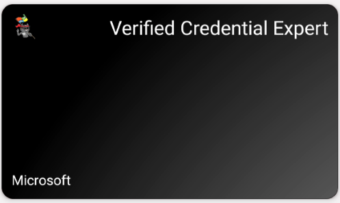

# Verifiable Credentials Code Samples

This code sample demonstrates how to use Microsoft Entra Verified ID to issue and consume verifiable credentials.

## About these samples

Welcome to Microsoft Entra Verified ID. With the code samples, we'll teach you to issue a verifiable credential: a Verified Credential Expert Card. You'll then use this card to prove to a verifier that you are a Verified Credential Expert, mastered in the art of digital credentialing.

There are several samples:
- [.NET](https://github.com/Azure-Samples/active-directory-verifiable-credentials-dotnet)
- [Java](https://github.com/Azure-Samples/active-directory-verifiable-credentials-java)
- [Node](https://github.com/Azure-Samples/active-directory-verifiable-credentials-node)
- [Python](https://github.com/Azure-Samples/active-directory-verifiable-credentials-python)

## Contents

The typical samples consist of 2 parts, an issuer and a verifier. The holder or user is using the wallet which is Microsoft Authenticator.

The samples are meant as a way to quickly understand the principles and the use of the Request API. If you are planning to create an application which needs to be run in production make sure you add proper error handling and other best practices.

## Prerequisites

For all the samples this are the minimum requirements:

- An Android or IOS device.
- Microsoft Authenticator installed on the mobile device.
- An Azure Active Directory (free) tenant.
- An Azure subscription where you have access to create an Azure Key Vault instance.

Refer to our [documentation](https://aka.ms/didfordevs) for more instructions on setting up your own Azure AD Verifiable Credentials environment.

## Contributing

This project welcomes contributions and suggestions.  Most contributions require you to agree to a
Contributor License Agreement (CLA) declaring that you have the right to, and actually do, grant us
the rights to use your contribution. For details, visit https://cla.opensource.microsoft.com.

When you submit a pull request, a CLA bot will automatically determine whether you need to provide
a CLA and decorate the PR appropriately (e.g., status check, comment). Simply follow the instructions
provided by the bot. You will only need to do this once across all repos using our CLA.

This project has adopted the [Microsoft Open Source Code of Conduct](https://opensource.microsoft.com/codeofconduct/).
For more information see the [Code of Conduct FAQ](https://opensource.microsoft.com/codeofconduct/faq/) or
contact [opencode@microsoft.com](mailto:opencode@microsoft.com) with any additional questions or comments.
