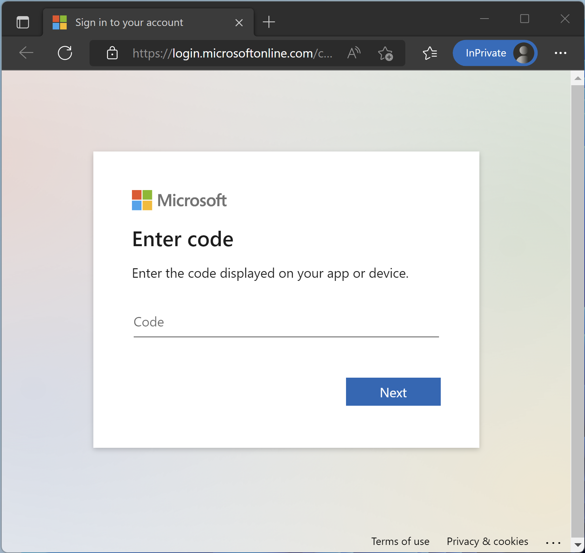
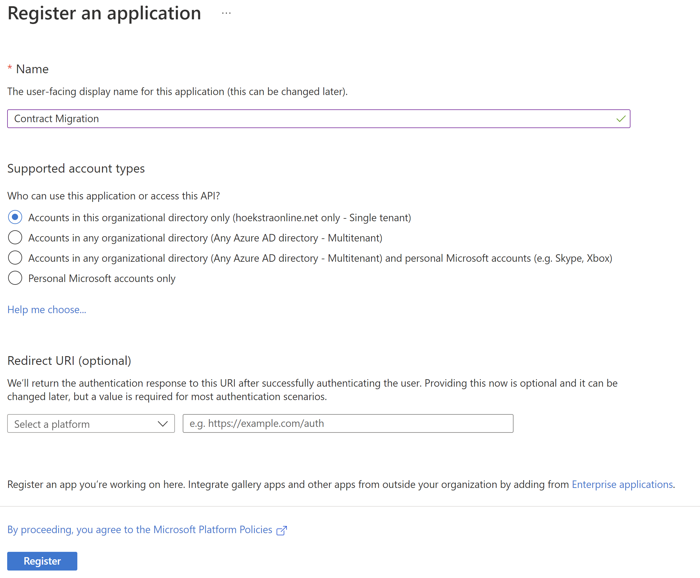
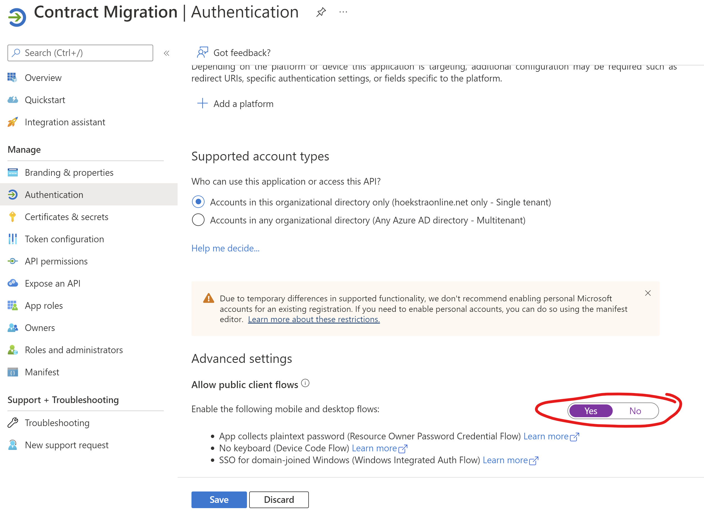
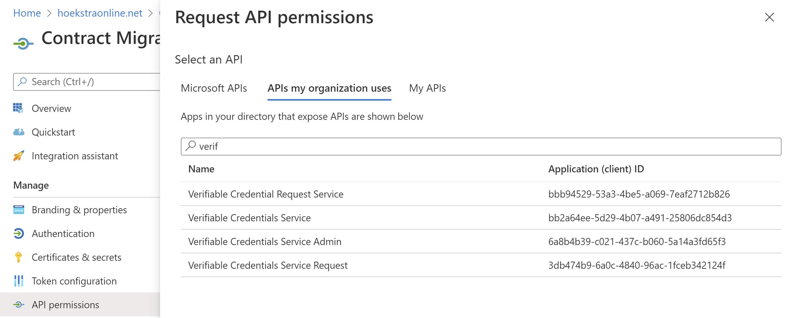
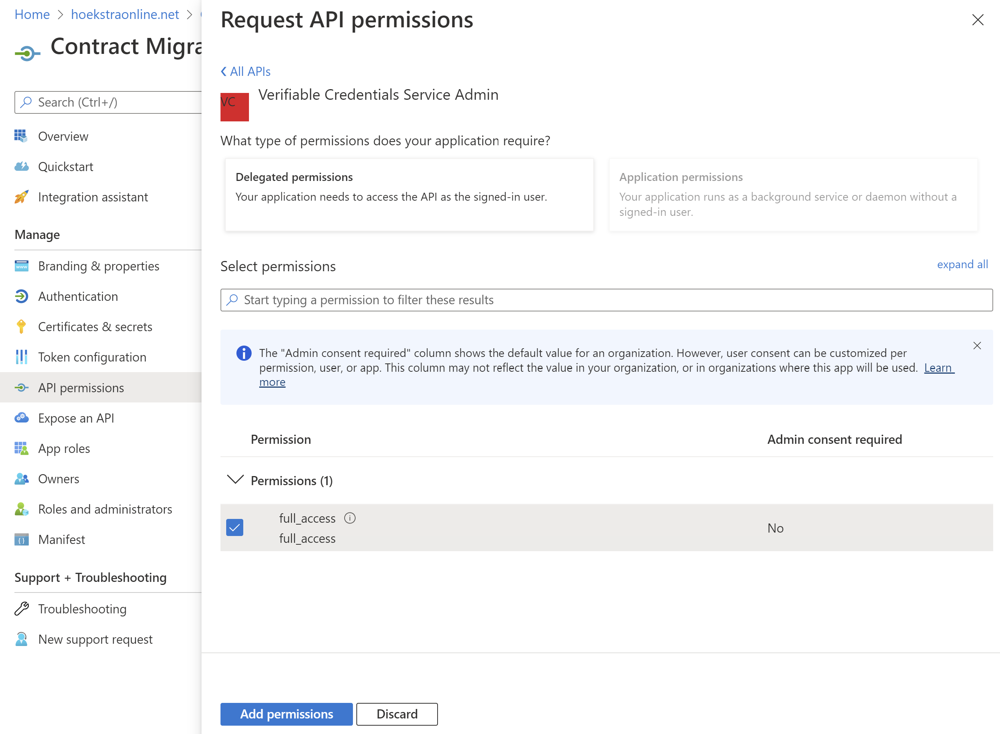
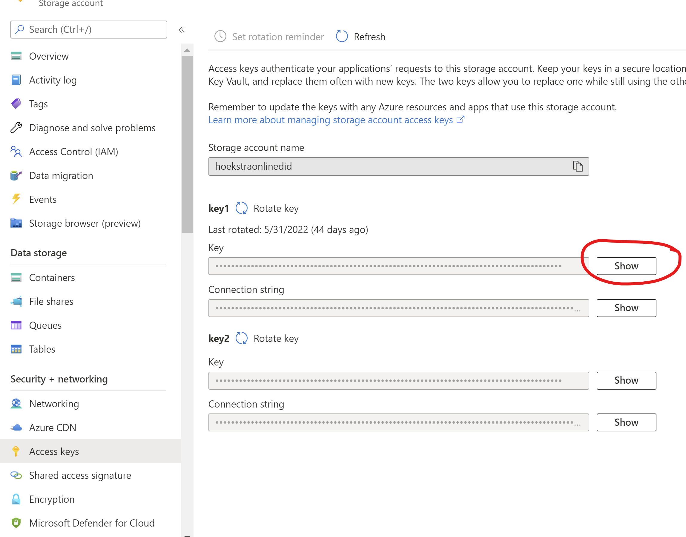

# Migrate your rules/display files based contracts to new managed custom credentials
As part of the release to GA we are removing support for file based contracts. This script will help you migrate those credentias to the new formats.

before you run the script you need to complete the [prerequisites](#prerequisites)

The PowerShell script can be run as followed:

`.\vc-migrate-off-storage.ps1 -TenantId "<YOUR AAD TENANTID>" -clientID "<YOUR APPID WITH API PERMISSION>" -StorageAccessKey "<YOUR STORAGE ACCESS KEY>"`

The application uses the, so called, device flow to sign in the PowerShell script and get the correct access token to be able to call the APIs we need to migrate contracts. 
When you run the script it will launch the default browser (Edge, Firefox or Chrome are supported). You need to paste the CODE generated in that windows, you can paste since the code is already on the clipboard.

After this the script will enumerate through the existing contracts and will migrate the contracts to the new managed custom contract format. By defaul the updates will not be written to the database. You need to uncomment the last few lines in the script to enable writing.

## Prerequisites

The following steps needs to be done to succesfully migrate contracts:
* Create an [app registration](#app-registration) in your Azure Active Directory tenant and grant permission to the API to migrate contracts
* Find your [Storate Access token](#find-storage-access-token) to grant the migration read access to the json files
* Run the script and check if there are any errors
* If everything looks good, remove the comments at the end of the script to enable writing the new contracts to the database

### App registration
As a first step you need to register an application in your Azure Active Directory. Navigate to [https://portal.azure.com](https://portal.azure.com) and go to the Azure Active Directory app registration [blade](https://portal.azure.com/#view/Microsoft_AAD_IAM/ActiveDirectoryMenuBlade/~/RegisteredApps)

Create a new app registration and enter a name. Leave the defaults and click on Register. Copy the Application (client) ID to use as argument in the PowerShell script. Also copy the Directory (tenant) ID.

Under Authentication make sure you select Yes for the Allow public client flows and click Save.

You need to configure the permissions to allow the script to read and migrate your contracts. Navigate to API permissions page.

Click Add a permission, select APIs my organization uses and search for the `Verifiable Credentials Service Admin` with Application (client) ID of 6a8b4b39-c021-437c-b060-5a14a3fd65f3

Select the Delegated permissions `full_access' and click Add permissions.

This completes the application registration part.

### Find Storage Access Token
For the PowerShell script to be able to read the contents of the display and rules json files it needs access to the Azure Storage account. If you have credentials configured with different storage account you need to run the migration script several times with storage access tokens for each storage account.

To find the storage access token navigate to your azure storage account on the azure portal and then navigate to the Azure Keys page like the screenshot below:

Click on the show button and copy the value.

## Troubleshooting

If you receive the following error after sign-in:
`{"error":"invalid_client","error_description":"AADSTS7000218: The request body must contain the
     | following parameter: 'client_assertion' or 'client_secret'.\r\nTrace ID`
Check if you did select the Allow Public client flow under authentication of your app registration

If you can't find the Verifiable Credentials Service Admin service principal when trying to add the API permissions please make sure you followed all these [steps](https://docs.microsoft.com/en-us/azure/active-directory/verifiable-credentials/verifiable-credentials-faq#updating-the-vc-service-configuration).
